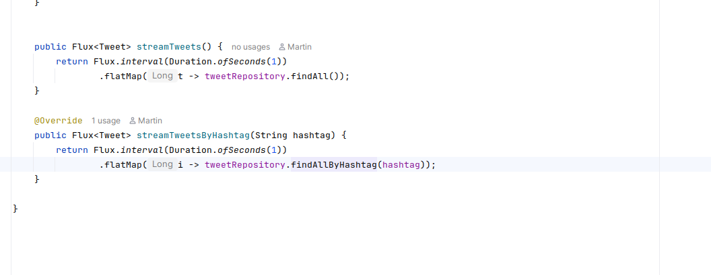
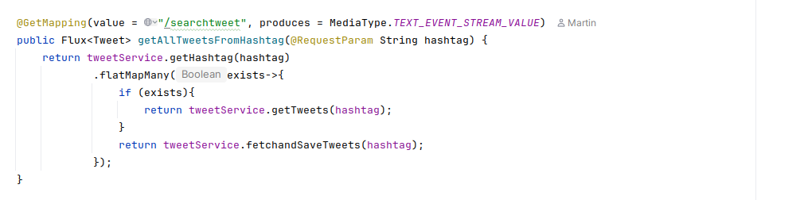
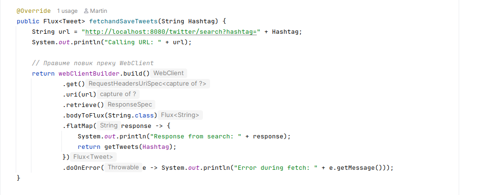
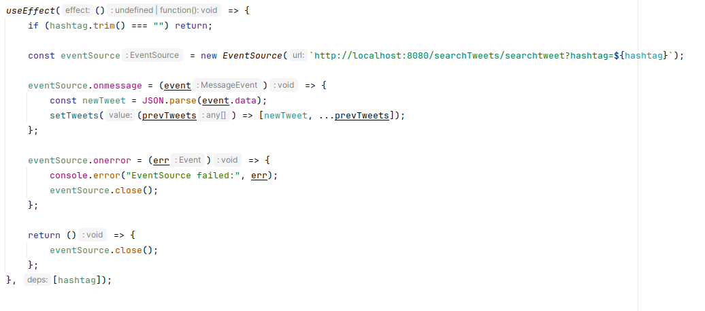

# Twitter HashTag Search App – Вежба по Реактивно програмирање

## 1. Вовед

Оваа апликација е практичен пример за примена на **реактивното програмирање** во веб апликации кои работат со податоци во реално време.

Со внесување на одреден **хаштаг** (на пример `#finki`), апликацијата преку backend се поврзува со Twitter API и почнува да ги прима твитовите кои содржат тој хаштаг. Податоците пристигнуваат постепено и се прикажуваат директно на frontend без да има потреба од освежување на страницата.

Целите на оваа вежба се студентите да:

* го разберат концептот на реактивното програмирање,
* научат што претставува `Flux` и како се користи,
* видат како се имплементира стримирање на податоци преку SSE,
* разберат како frontend и backend комуницираат во реално време.

---

## 2. Основи на реактивно програмирање

Реактивното програмирање се базира на концептот на **асинхроност** и **стримови од податоци**. Наместо програмата да чека нешто да заврши, таа реагира на настани штом се појават.

### 2.1. Класичен (blocking) модел

* Секој повик кон надворешен сервис чека да се врати резултат.
* За тоа време ресурсите се блокирани.
* Системот има ограничена скалабилност.

Пример:

```java
List<Tweet> tweets = api.getTweets("#java");
```

### 2.2. Реактивен модел

* Работи по принцип **Publisher–Subscriber**.
* Податоците пристигнуваат во форма на стрим.
* Наместо да добиеме една листа, добиваме елементи еден по еден.

Пример:

```java
Flux<Tweet> tweets = tweetRepository.findAllByHashtag("#java");
```

---

## 3. Backend – Контролер

Контролерот е точката преку која клиентите се поврзуваат со backend. Наместо да враќа конечен список, контролерот враќа **реактивен стрим** кој постојано испраќа нови твитови до клиентот.

Ова е овозможено преку специјален тип на одговор наречен **Server-Sent Events (SSE)**.
* produces = MediaType.TEXT_EVENT_STREAM_VALUE овозможува SSE.

* Податоците се праќаат кон клиентот веднаш штом се достапни, без потреба од polling.

Пример:



---
## 4. Backend – Репозиториум
Проектот користи ReactiveCrudRepository, кој автоматски овозможува работа со реактивни стримови.


## 5. Backend – Сервис

Сервисот има задача да се поврзе со Twitter API и да врати реактивен стрим од податоци.

За таа цел се користи **WebClient**, кој овозможува не-блокирачки HTTP повици. Тој го презема одговорот од Twitter и го претвора во `Flux`.

Пример:



---

## 6. Frontend – Реално време

Frontend делот ја користи `EventSource` технологијата за да слуша на backend endpoint-от и да прикажува нови твитови во реално време.

Секојпат кога ќе пристигне нов твит:

* тој се додава во листата на елементи,
* интерфејсот автоматски се ажурира.

Пример:



---

## 7. Архитектура – тек на податоци

1. Корисникот внесува хаштаг.
2. Фронтенд воспоставува конекција преку SSE.
3. Backend сервисот преку `WebClient` прави повик до Twitter API.
4. Податоците се претвораат во `Flux`.
5. Контролерот ги стримира кон клиентот.
6. Фронтенд апликацијата ги прикажува новите твитови веднаш.

---

## 8. Заклучок

Со оваа апликација гледаме:

* како реактивното програмирање го заменува класичниот блокирачки пристап,
* како `Flux` овозможува работа со податоци кои пристигнуваат постепено,
* како се користи SSE за реално време комуникација,
* и како frontend и backend работат синхронизирано за подобро корисничко искуство.

Овој модел претставува модерен начин на градење апликации кои бараат брзина, скалабилност и работа со динамички податоци.
